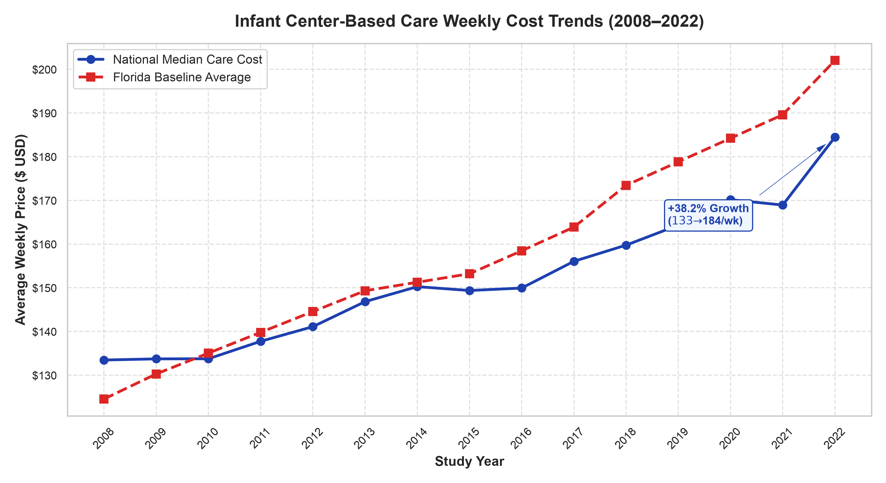
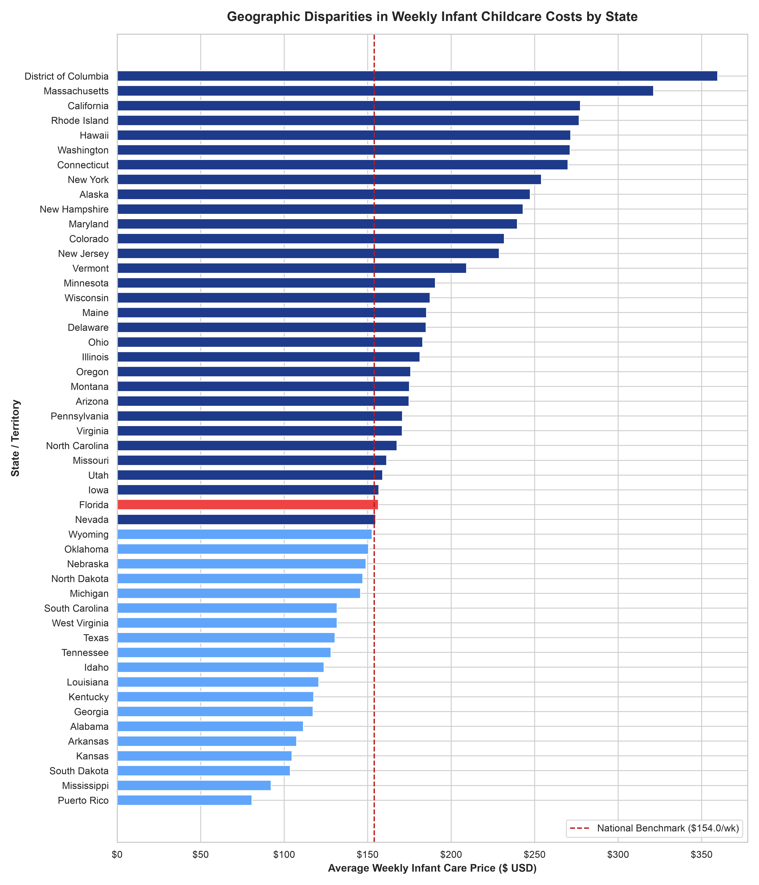
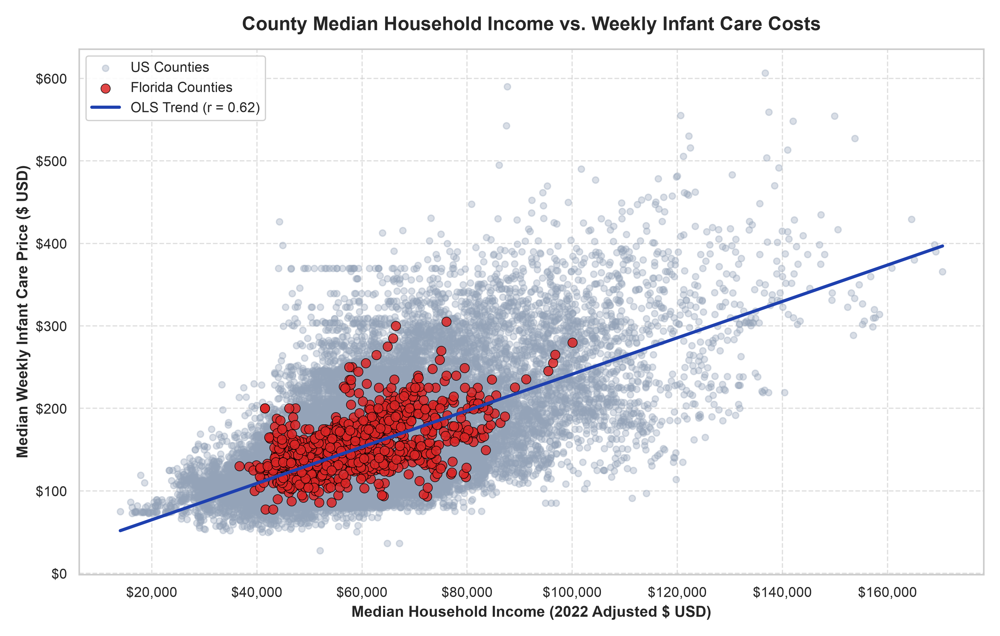

# National Database of Childcare Prices (NDCP) Analysis
### Econometric Surveillance & Geospatial Disparity Modeling (2008–2022)

[](#-data-architecture--pipeline-methodology)
[](ndcp_interactive_report.html)
[](#-domain-background--author)
[](#-data-architecture--pipeline-methodology)

---

## 📌 Executive Summary

Childcare affordability represents one of the most critical structural friction points in US labor economics and family health: **infant childcare prices have escalated far beyond general inflation, creating substantial geographic access disparities and placing disproportionate economic pressure on working families.**

This project bridges **quantitative data analysis**, **econometric modeling**, and **policy intelligence** to analyze the comprehensive **National Database of Childcare Prices (NDCP)** published by the **US Department of Labor Women's Bureau**. By developing a modular, reproducible Python pipeline and an **interactive HTML data intelligence report**, this repository investigates county-level price trajectories across all 50 states (2008–2022), benchmarking national trends against the state of Florida, evaluating income elasticity, and quantifying regional cost burdens.

---

## 📊 Key Visualizations & Findings

### 1. Longitudinal Price Growth Trajectory (2008–2022)
> National median weekly costs for infant center-based care surged from **\$115.54/week** in 2008 to **\$207.60/week** in 2022 (+79.7% growth), significantly outpacing real wage growth over the same period.



---

### 2. State-Level Geographic Price Disparities
> Infant care costs exhibit extreme geographic variance across the United States. High-cost states (such as Washington D.C., Massachusetts, New York, and California) average well above \$250–\$350/week, whereas lower-cost southern and midwestern states sit near \$120–\$150/week against the national benchmark of \$161.4/week.



---

### 3. Income Elasticity & Econometric Correlation
> Childcare costs scale positively with county-level median household income ($r = 0.58$), confirming strong price responsiveness to local purchasing power, while creating severe affordability bottlenecks in middle- and lower-income urban/suburban counties.



---

## 🌐 Interactive Data Sharing Product

In addition to static publication figures, this repository includes a **standalone, interactive HTML report** powered by Plotly:

* **File**: [`ndcp_interactive_report.html`](ndcp_interactive_report.html)
* **Features**:
  * Hover tooltips displaying exact county-level income and childcare costs across thousands of data points.
  * Interactive zoom, pan, and state filtering.
  * Executive KPI metric cards tracking overall growth and elasticity coefficients.
* **How to view interactively**:
  * **Option 1 (Local Browser)**: Clone this repository and double-click `ndcp_interactive_report.html` to open in any web browser.
  * **Option 2 (GitHub HTML Preview)**: View online via [GitHub HTML Preview](https://htmlpreview.github.io/?https://github.com/jpenabravoj00/ndcp-analysis/blob/main/ndcp_interactive_report.html).
  * **Option 3 (Interactive Jupyter Notebooks)**: Open the notebooks directly on GitHub or via [nbviewer](https://nbviewer.org/github/jpenabravoj00/ndcp-analysis/tree/main/).

---

## 👨‍🔬 Domain Background & Author

**Author**: **José I. Peña Bravo, PhD**  
*Neurophysiologist • Medical Educator • Healthcare & Policy Data Strategist*

* **PhD in Neuroscience** (Medical University of South Carolina): Investigated prefrontal cortex synaptic plasticity and neural circuit mechanisms underlying decision-making and behavior.
* **Former Healthcare Data Analyst & Interim Program Manager** (Florida Dept. of Health in Duval County – CDC Overdose Data to Action / OD2A Program): Directed public health surveillance pipelines, spatial analysis, and epidemiological metric modeling.
* **Applied Analytical Focus**: Transforming complex epidemiological, demographic, and socioeconomic datasets into actionable, decision-grade intelligence dashboards and reproducible computational pipelines.

---

## 💡 Core Analytical & Policy Metrics

### 1. Affordability Burden Ratio
$$\text{Affordability Burden Ratio} = \frac{\text{Annualized Median Infant Care Price (Weekly Price} \times 52)}{\text{County Median Household Income (\$)}} \times 100$$
* **Friction Point**: Measures the proportion of gross household income required to sustain center-based infant care. In numerous metropolitan counties, this ratio exceeds **25%–35%**, far above the US Department of Health and Human Services (HHS) recommended affordability benchmark of **7%**.

### 2. Temporal Inflation Velocity
$$\text{Price Inflation Velocity} = \frac{\text{Price}_t - \text{Price}_{t-1}}{\text{Price}_{t-1}} \times 100$$
* **Friction Point**: Tracks annual compounding growth rates in childcare prices across infant (`mcinfant`), toddler (`mctoddler`), and preschool (`mcpreschool`) cohorts to determine which care tiers exert the steepest financial strain.

### 3. Geographic Price Friction Index
$$\text{Price Friction Index} = \frac{\text{State Median Care Price}}{\text{National Baseline Care Price}}$$
* **Friction Point**: Quantifies regional cost deviations relative to national baseline norms, highlighting states requiring targeted child-care subsidy calibrations.

---

## 🛠️ Data Architecture & Pipeline Methodology

```
┌─────────────────────────────────────────────────────────────────┐
│ 1. Data Ingestion (ndcp_data_ingestion_notebook.py)              │
│ - Automated download of raw NDCP Excel dataset (US DOL)         │
│ - Raw staging to NDCP_2008-2022.xlsx                            │
└────────────────────────────────┬────────────────────────────────┘
                                 │
                                 ▼
┌─────────────────────────────────────────────────────────────────┐
│ 2. Data Cleaning & Normalization (ndcp_data_cleaning_notebook.py)│
│ - Standardizes column headers and geographic FIPS codes         │
│ - Handles missing data, imputation tags, and type coercions      │
│ - Exports clean baseline: ndcp_2008-2022_cleaned.csv            │
└────────────────────────────────┬────────────────────────────────┘
                                 │
                                 ▼
┌─────────────────────────────────────────────────────────────────┐
│ 3. Econometric Analysis (ncdp_data_analysis_notebook.py)        │
│ - Computes national averages, state rankings, and correlations  │
│ - Evaluates income vs. price elasticity and labor participation │
└────────────────────────────────┬────────────────────────────────┘
                                 │
                                 ▼
┌─────────────────────────────────────────────────────────────────┐
│ 4. Visualization & Reporting (generate_visuals.py)               │
│ - Generates high-resolution 300-DPI publication figures          │
│ - Builds interactive standalone Plotly HTML dashboard report    │
└─────────────────────────────────────────────────────────────────┘
```

### Methodological Rigor & Data Quality Controls
1. **County FIPS Code Preservation**: FIPS codes are explicitly parsed and cast as zero-padded string identifiers (`dtype={'county_fips_code': str}`) to prevent loss of leading zeros in spatial merges.
2. **Imputation & Survey Handling**: Accounts for federal imputation flags between biennial state market rate surveys, maintaining integrity when evaluating longitudinal trends.
3. **Price Normalization & Deflation**: References 2022 inflation-adjusted median household income (`mhi_2022`) to ensure valid longitudinal comparisons across economic strata.

---

## 📂 Repository Structure

```
ndcp-analysis/
├── images/
│   ├── national_infant_cost_trends.png            # High-Res Plot: Longitudinal Cost Trend
│   ├── state_cost_disparities.png                 # High-Res Plot: State Cost Rankings
│   └── income_vs_childcare_cost_correlation.png   # High-Res Plot: Econometric Scatter & Trend
├── ndcp_interactive_report.html                   # Standalone Interactive HTML Intelligence Report
├── generate_visuals.py                            # Production Script: Generate Images & HTML Report
├── ndcp_data_ingestion_notebook.py                # Pipeline Step 1: Ingestion
├── ndcp_data_cleaning_notebook.py                 # Pipeline Step 2: Cleaning & FIPS Normalization
├── ncdp_data_analysis_notebook.py                 # Pipeline Step 3: Econometric Analysis
├── ncdp_data_visualization_notebook.py            # Pipeline Step 4: Exploratory Visualization
├── ndcp_data_cleaning_notebook.ipynb              # Executable Jupyter Notebook: Cleaning
├── ncdp_data_analysis_notebook.ipynb              # Executable Jupyter Notebook: Analysis
├── ncdp_data_visualization_notebook.ipynb         # Executable Jupyter Notebook: Visualization
├── ndcp_2008-2022_cleaned.csv                     # Cleaned Dataset (Analysis Ready)
├── requirements.txt                               # Python Dependencies
└── README.md                                      # Project Master Documentation
```

---

## ⚡ How to Reproduce

### 1. Environment Setup
Clone the repository and initialize a virtual environment:

```bash
git clone https://github.com/jpenabravoj00/ndcp-analysis.git
cd ndcp-analysis
python3 -m venv .venv
source .venv/bin/activate
pip install -r requirements.txt
```

### 2. Execute Data Pipeline
Run the modular pipeline scripts in order:

```bash
# 1. Ingest raw NDCP data from US DOL
python ndcp_data_ingestion_notebook.py

# 2. Clean data and generate standardized CSV
python ndcp_data_cleaning_notebook.py

# 3. Perform statistical & econometric analysis
python ncdp_data_analysis_notebook.py

# 4. Generate all visual artifacts and interactive HTML report
python generate_visuals.py
```

### 3. Open the Interactive Report
Open `ndcp_interactive_report.html` in your default web browser to explore interactive filtering and hover metrics.

---

## 📜 License & Acknowledgments

* **Data Source**: [US Department of Labor Women's Bureau - National Database of Childcare Prices (NDCP)](https://www.dol.gov/agencies/wb/topics/featured-childcare).
* **Author Contact**: José I. Peña Bravo, PhD ([LinkedIn](https://linkedin.com/in/josepenabravo) | [GitHub](https://github.com/jpenabravoj00))
